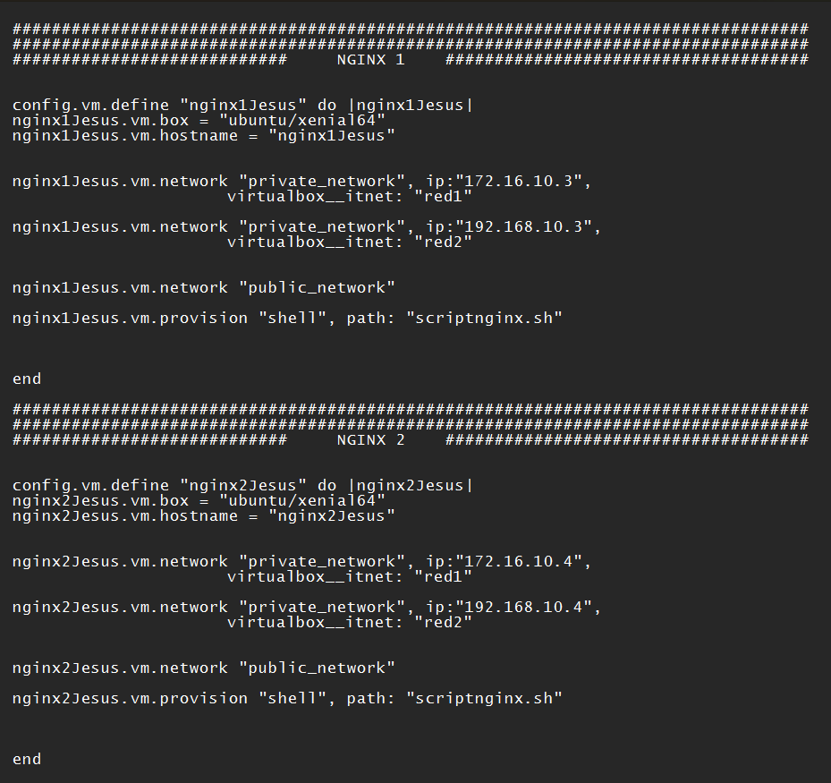

# CMS EN ARQUITECTURA EN 3 CAPAS
### **ÍNDICE**
#### 1. Arquitectura
#### 2. Creación de las máquinas
#### 3. Balanceador de carga
#### 4. Servidor NFS
#### 5. Servidores web
#### 6. Servidor de base de datos Mysql
#
### **ARQUITECTURA**
#### Para esta prática implementaremos una pila LAMP en tres niveles, junto a un *Servidor NFS* que nos permitirá compartir datos con los *Servidores Web*. También haremos uso de un balanceador de carga para distribuir las peticiones a los servidores web evitando sobrecargar uno de ellos
#
### **CREACIÓN DE LAS MÁQUINAS**
#### Para empezar editamos el documento Vagrantfile para crear las máquinas que usaremos en la práctica, declarando sus direcciones ip, nombres, sistema operativo y scripts de aprovisionamiento
#
#### El balanceador lo creamos con un sistema operativo *Ubuntu/xenial64* y con una única dirección ip privada dentro de la subred 172.16.10.0, pues el balanceador nunca necesitará acceder al servidor de la base de datos. También añadimos una ip pública, pues esta máquina será la única a la que acceda directamente el usuario (aunque luego redireccionará al usuario hacia uno de los dos servidores web)
#

#
#### El script de aprovisionamiento para el balanceador incluye simplemente una instalación de *Nginx*
#

#
#### Los *servidores web* los creamos cada uno con su respectiva dirección ip privada dentro de la subred 172.16.10.0 para que puedan comunicarse con el balanceador. Del mismo modo, a ambos les añadimos respectivamente una dirección ip dentro de la nueva subred 192.168.10.0, que será la subred en la que se encuentre el servidor de la base de datos. Por último también llevarán una dirección ip pública que utilizaremos para poder configurar las máquinas. Una vez terminado el proceso, las eliminaremos, pues estas máquinas no serán accesibles de forma directa para el usuario.
#

#
#### El script de aprovisionamiento para los servidores web incluirá la instalación de *Nginx*, varios módulos Php necesarios y el *nfs-common*, ya que ambas máquinas serán clientes del servidor NFS.
#

#
#### El *servidor NFS* lo creamos con una dirección ip para cada una de las subredes, al igual que hemos hecho con los *servidores web*. También tendrá una dirección ip pública que nos servirá para poder configurarlo. Posteriormente la eliminaremos.
#

#
#### El script de aprovisionamiento incluirá la instalación de *php-fpm, php-mysql* y también *nfs-kernel-server*, ya que esta máquina actuará como servidor NFS.
#

#
#### Por último el *servidor de la base de datos* lo crearemos con una dirección ip perteneciente a la subred 192.168.10.0, ya que en ningún momento necesitará comunicarse con el balanceador.
#

#
#### El script de aprovisionamiento incluye únicamente la instalación de *mysql-server* para que podamos alojar la base de datos de mysql en esta máquina.
#

#
#### Una vez creadas y aprovisionadas todas las máquinas, ya podemos empezar a configurar cada una
#
#
### **BALANCEADOR DE CARGA**
#
#### Para configurar *Nginx* como balanceador lo primero será eliminar el fichero por defecto que trae *Nginx*. Para eso nos situamos en la ruta */etc/nginx/sites-enabled* y eliminamos el archivo *default*. Posteriormente crearemos un nuevo archivo en la ruta */etc/nginx/conf.d/* donde especificaremos el funcionamiento de *Nginx* como balanceador (posteriormente reiniciaremos Nginx para aplicar los cambios)
#

#
#### En el nuevo archivo de configuración del balanceador añadiremos las direcciones ip de los *servidores web*. Para el servidor especificaremos que escuche en el puerto 80 y también especificamos el proxy_pass
#

#
#### Con esto el balanceador ya está configurado y cuando realicemos una petición a su dirección ip pública nos redirigirá a uno de los 2 *servidores web*
#
#
### **SERVIDOR NFS**
#
#### Para empezar tendremos que crear el directorio que utilizaremos para compartir el contenido con los *servidores web*. Una vez creado cambiaremos el dueño del durectorio a *nobody:nnogroup* para que nadie sea el dueño y los *servidores web* puedan acceder a su contenido compartido sin problemas
#

#
#### Una vez hecho, tenemos que configurar el archivo */etc/exports* para permitir el acceso al directorio compartido solamente a los *servidores web*. Lo haremos especificando el directorio, las ips de los servidores web y una serie de opciones para poder leer y escribir, forzar al NFS a escribir los cambios en el disco antes de reemplazarlos y prevenir el checkeo de archivo, lo cual puede causar problemas
#

#
#### Tras esto reiniciaremos el servicio nfs-kernel-server para aplicar los cambios y dentro de la carpeta compartida descargamos y descomprimimos Prestashop (descargando previamente la herramienta unzip)
#

#
#### Una vez terminado de configurar el servidor NFS, podemos configurar los *servidores web* que actuarán como clientes NFS
#
#
### **SERVIDORES WEB**
#
#### Lo primero será crear un nuevo directorio para crear el punto de montaje con el directorio compartido del *servidor NFS*. Una vez creado, con el comando *mount* y especificando la dirección ip del sercidor NFS, el directorio compartido y el recientemente creado, creamos el punto de montaje. Podemos comprobar que todo ha salido bien con el comando *df -h* y observando que abajo del todo nos sale una línea con la dirección ip del servidor NFS y su carpeta compartida
#

#
#### Una vez hecho, nos queda editar el fichero de configuración por defecto de Nginx para añadir la ruta de nuestra carpeta compartida, añadir index.php a la lista y descomentar algunas líneas
#

#
#### Ya solo queda comprobar que todo está correcto con el comando *nginx -t*. Tras comprobar que todo está bien, reiniciamos Nginx y ya tendríamos un servidor web configurado. Ahora hay que repetir el mismo proceso con el otro.

#
#
### **SERVIDOR DE BASE DE DATOS MYSQL**
#
#### Lo primero será entrar a Mysql como root. En mi caso la contraseña se asignó durante la instalación de *mysl-server*. Tras acceder a mysql, creamos una base de datos para *Prestashop*. Creamos un nuevo usuario para la base de datos y le damos todos los privilegios. Por último recargamos los privilegios y ya podemos salir de Mysql.
#

#
#### Ahora editamos el archivo */etc/mysql/mysql.conf.d/mysqld.cnf* y buscamos la dirección de enlace (bind-address) y la cambiamos por la dirección ip del servidor MySql.
#

#
